# 🍹 Peanut Drinks

Loja fictícia de bebidas, criada como projeto pessoal. Começou em 2025 como um site de HTML, CSS e
JavaScript puro — meu primeiro projeto feito inteiramente do zero. Em 2026 reescrevi tudo em **React
+ TypeScript**, mantendo a identidade visual original e a versão antiga no repositório para
comparação.

**[🔗 Ver o projeto ao vivo](https://lucasbrandaocabral.github.io/Peanut__Drinks/)** · [ver a versão antiga](https://lucasbrandaocabral.github.io/Peanut__Drinks/legacy/index.html)

| | |
| --- | --- |
| **Stack** | React 19, TypeScript, Vite 7, Tailwind CSS 4, React Router 7, Framer Motion |
| **Versão antiga** | HTML5, CSS3, JavaScript — preservada em [`legacy/`](legacy/) |
| **Design** | [Figma — Peanut Drinks](https://www.figma.com/design/Xt5t3v263oMSjtBRsHMZ7i/Peanut-Drinks--%F0%9F%8D%B9?m=auto&t=f7izsUK4liRlTSH3-6) |

---

## 📸 Antes e depois

Todas as capturas foram tiradas do mesmo jeito: Chrome a 1280×900, as duas versões rodando
localmente.

### Home

| Antes — HTML/CSS/JS | Depois — React |
| :---: | :---: |
| 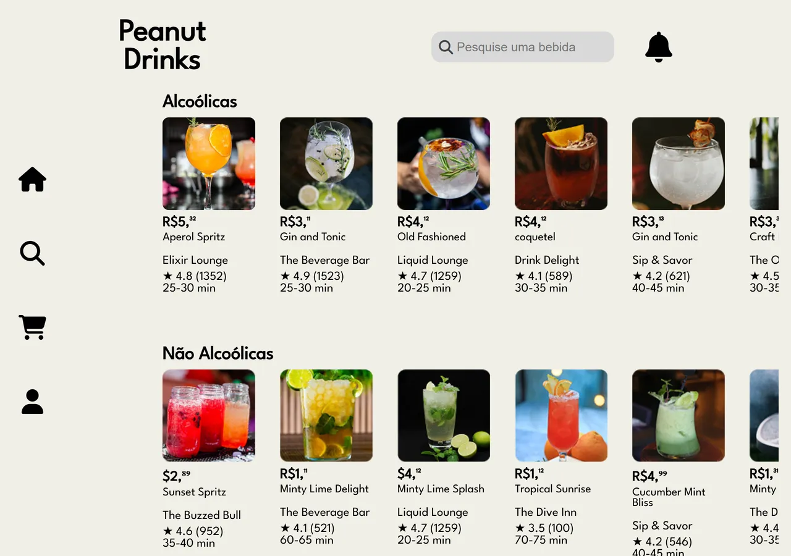 | 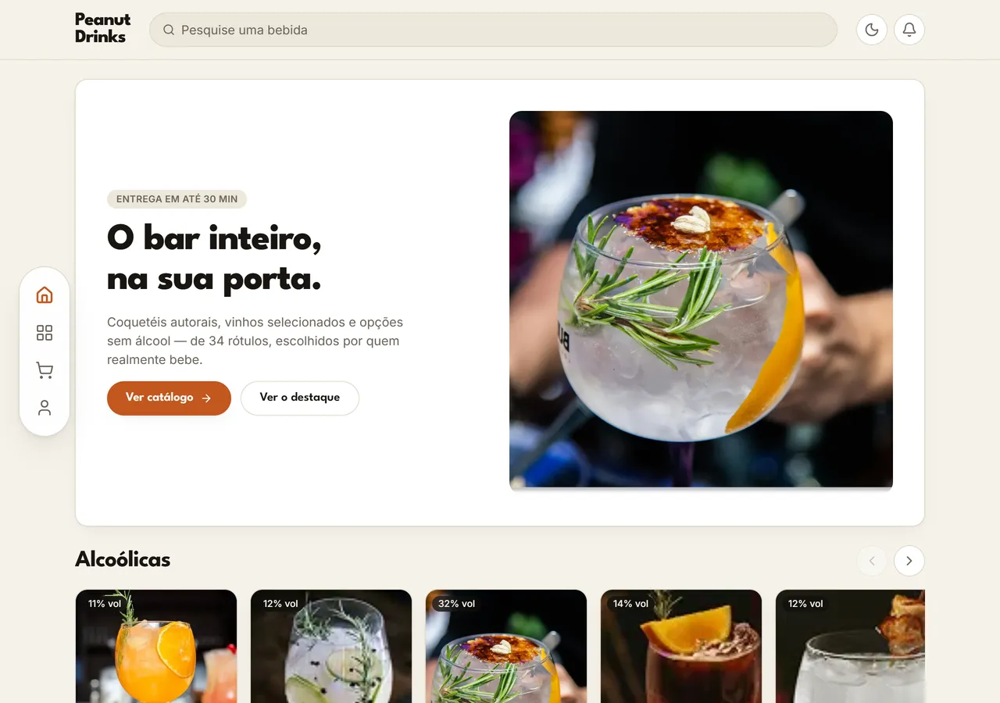 |

A home antiga abria direto na lista de produtos, com os cards cortados na lateral e sem nenhum ponto
de entrada. A nova tem hero, busca funcional e trilhos horizontais que indicam o que ainda há para
rolar.

### Catálogo

| Antes | Depois |
| :---: | :---: |
| 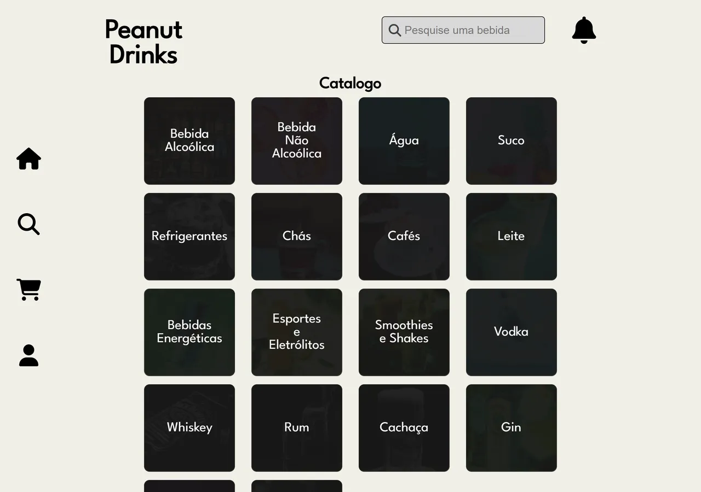 | 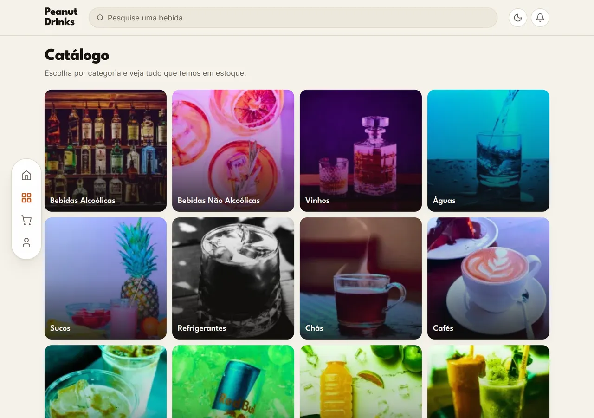 |

### Página de produto

| Antes | Depois |
| :---: | :---: |
| 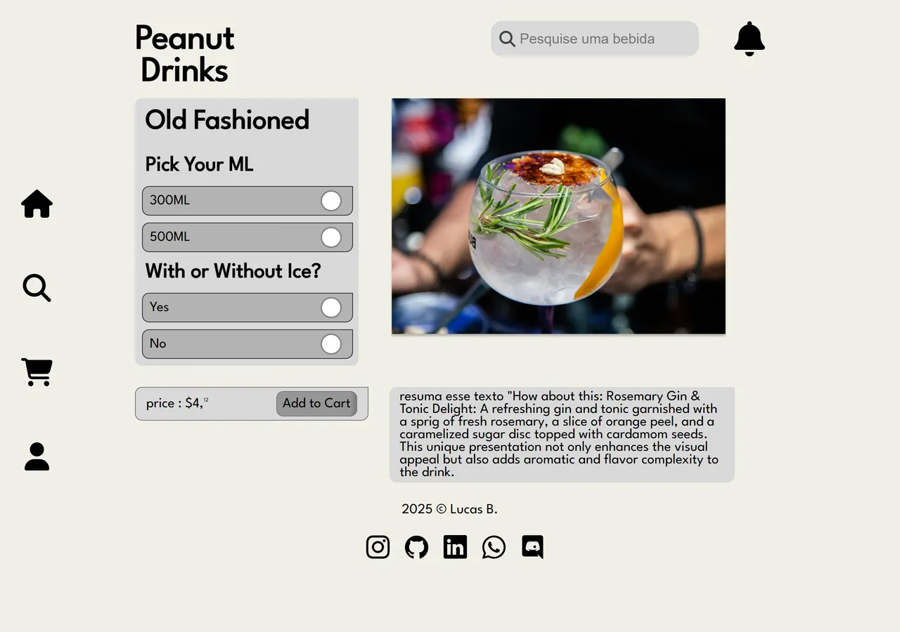 | 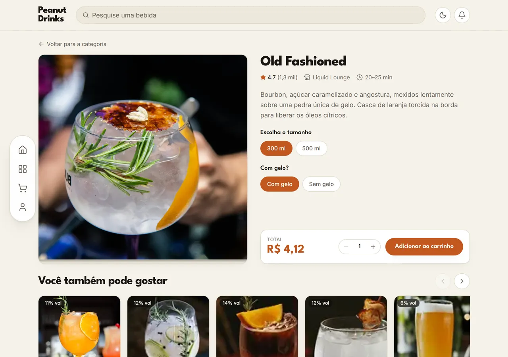 |

As opções de tamanho e gelo eram `input[type=radio]` soltos, sem efeito nenhum. Agora alimentam o
item do carrinho e o total é recalculado na hora.

### Carrinho

| Antes | Depois |
| :---: | :---: |
| 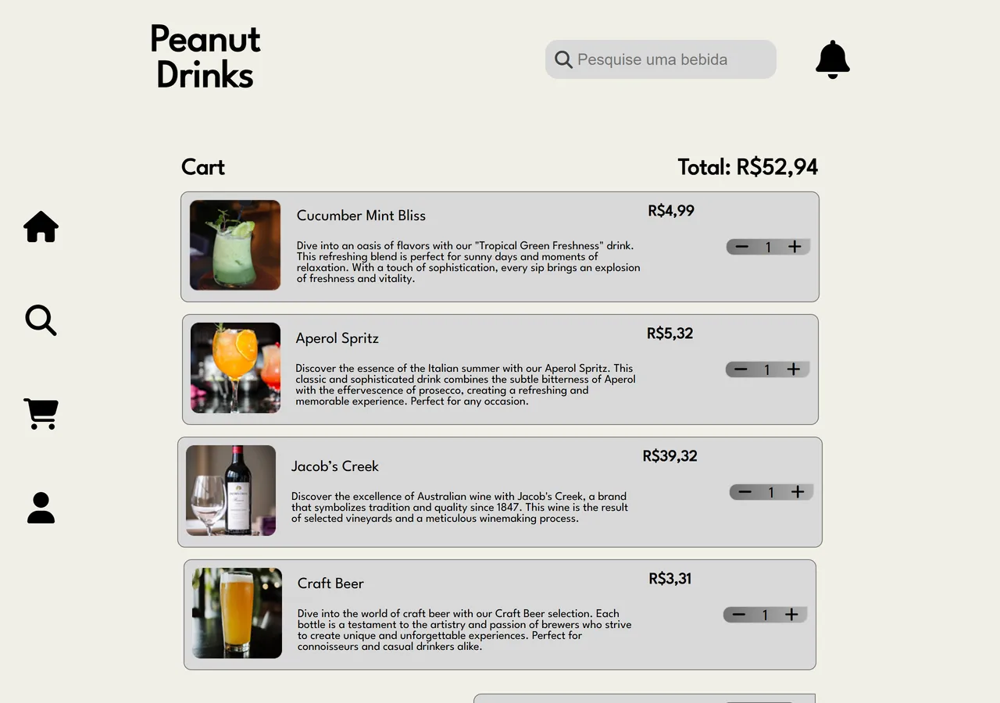 | 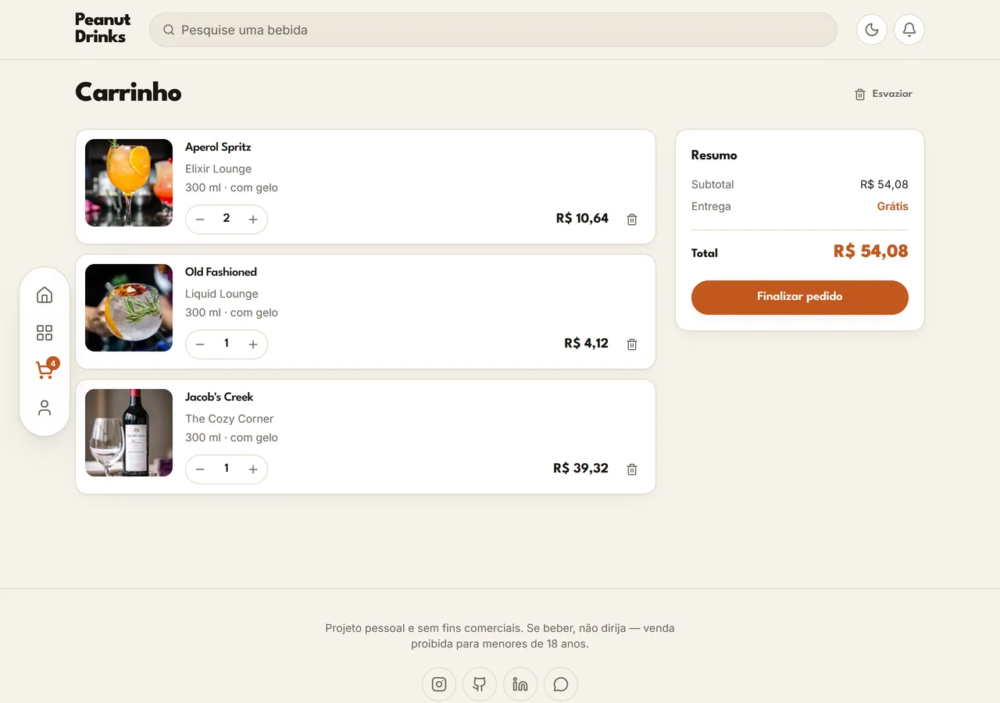 |

O carrinho antigo tinha três itens escritos à mão no HTML e o total sumia ao recarregar a página.
O novo persiste em `localStorage`, calcula frete e some com a linha quando a quantidade chega a zero.

### Pagamento

| Antes | Depois |
| :---: | :---: |
| 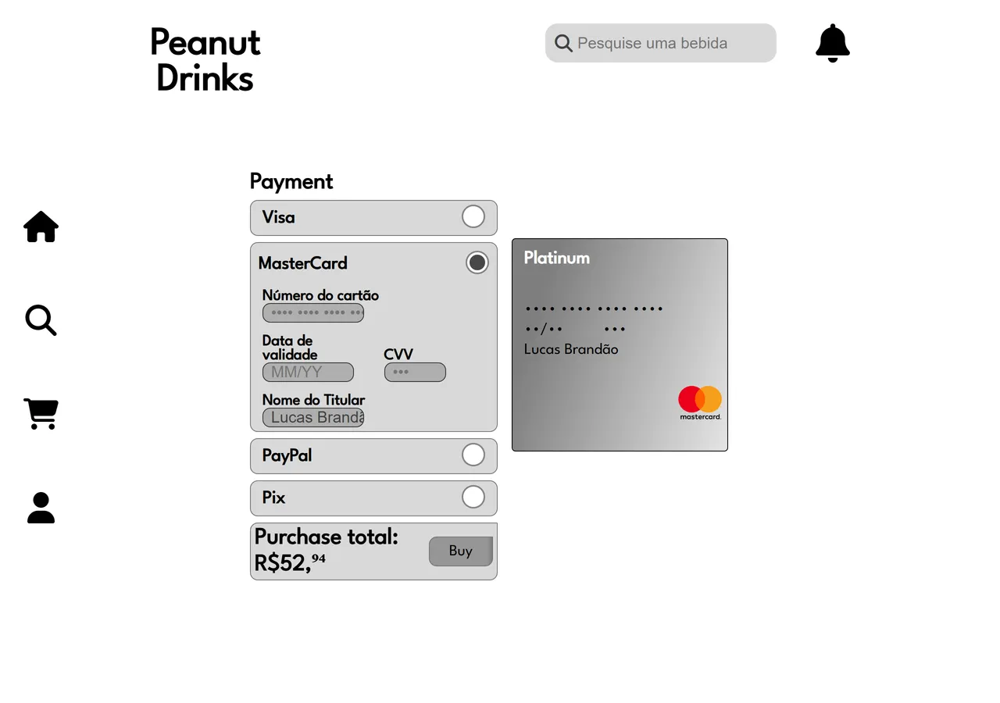 | 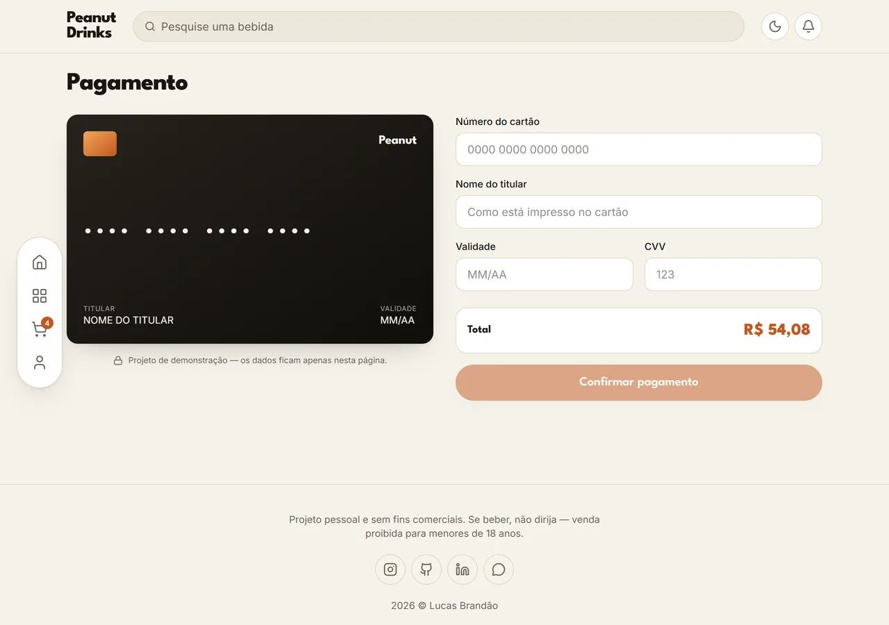 |

### Perfil

| Antes | Depois |
| :---: | :---: |
| 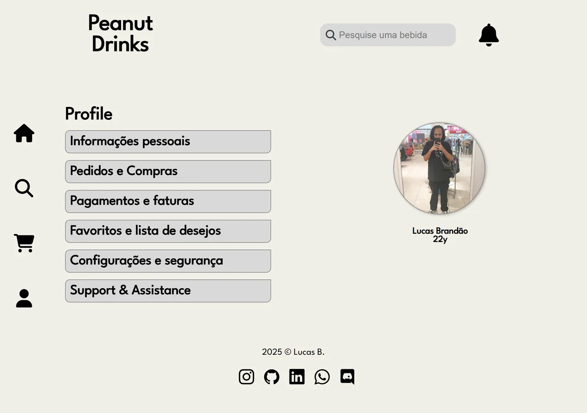 | 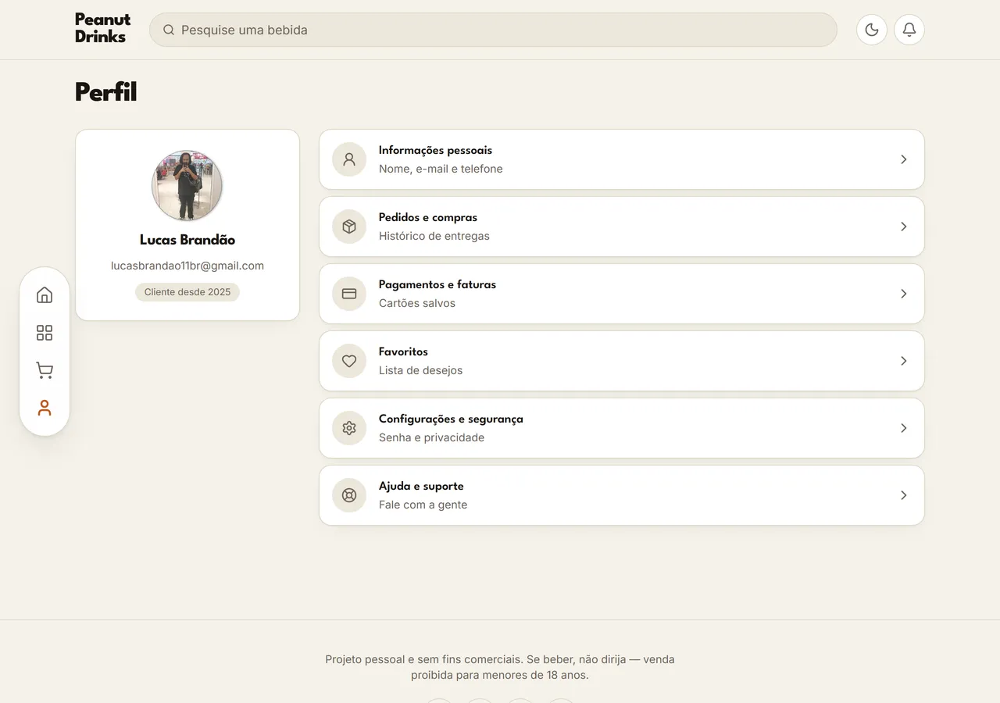 |

### Modo escuro e mobile

O tema escuro não existia na versão antiga. No mobile, a barra inferior agora tem rótulo em cada
ícone e o conteúdo não fica mais escondido atrás dela.

| Tema escuro (novo) | Mobile antes | Mobile depois |
| :---: | :---: | :---: |
| 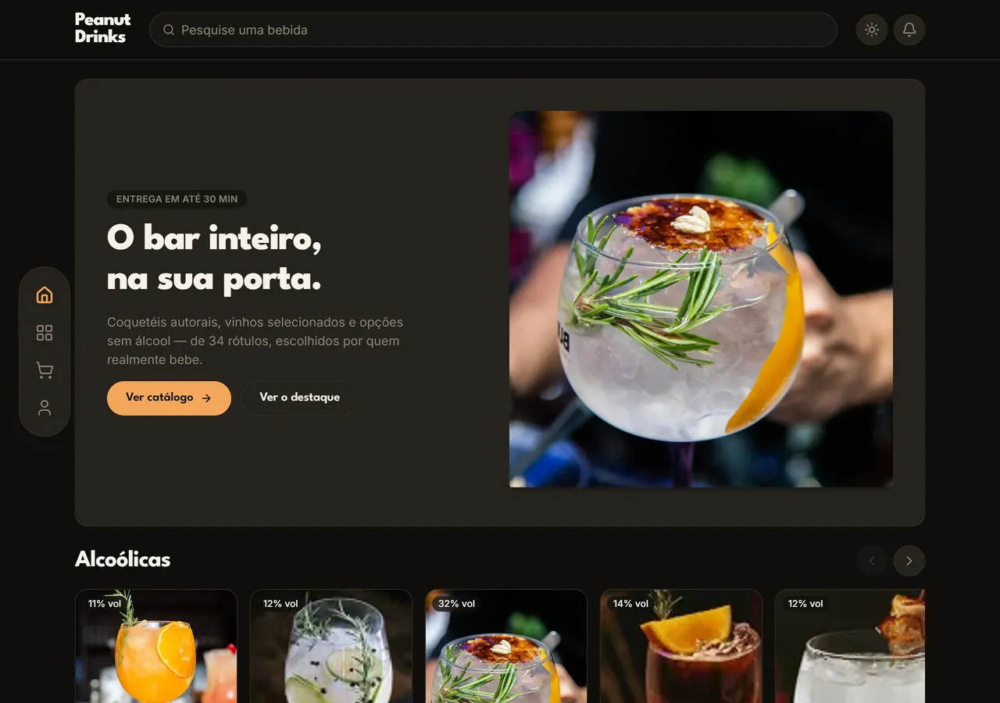 | 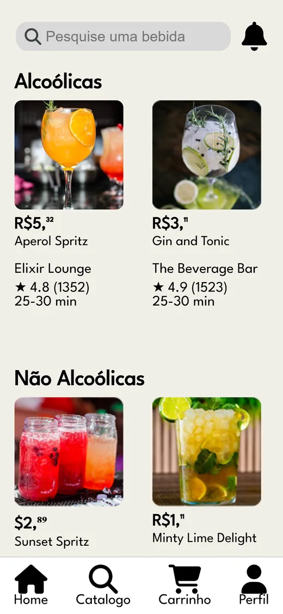 | 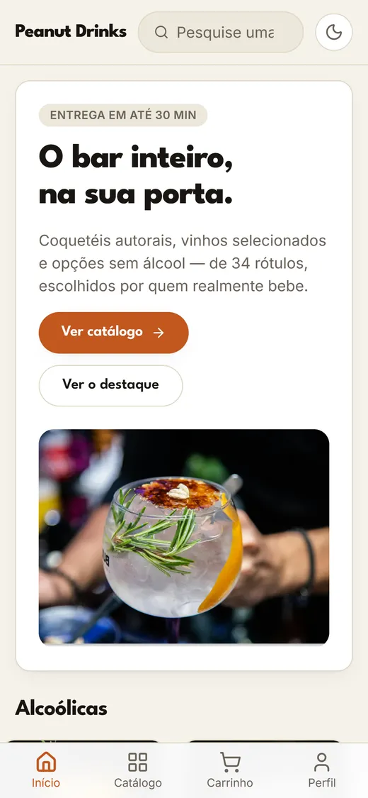 |

---

## 📊 O que mudou, em números

Medido com o Chrome, as duas versões servidas localmente, carregando a home até a rede ficar ociosa:

| | Antes | Depois |
| --- | ---: | ---: |
| Peso das imagens do catálogo | 12,3 MB | **0,54 MB** (−96%) |
| Requisições na home | 39 (17 para CDNs externos) | **36 (3 externos)** |
| Bytes transferidos na home | 984 KB | **772 KB** |
| Produtos exibidos na home | 18 | **34** |
| Arquivos HTML com header/nav/footer copiados | 8 | **0** |
| Linhas de CSS | 2.551 em 8 arquivos | **130** de tokens + utilitários |
| Cobertura de tipos | nenhuma | **TypeScript em modo estrito** |

A versão nova mostra quase o dobro de produtos e ainda assim transfere menos bytes. O ganho vem de
três lugares: conversão das imagens para WebP, remoção dos CDNs de ícones e divisão do JavaScript por
rota.

---

## 🔧 O que foi reescrito

**Arquitetura**
- Header, navegação e rodapé eram copiados e colados nos 8 arquivos HTML. Qualquer ajuste no menu
  significava editar os 8. Hoje são três componentes em [`src/components/layout/`](src/components/layout/).
- Os produtos estavam escritos direto na marcação — 36 cards em HTML. Agora vivem em
  [`src/data/products.ts`](src/data/products.ts) e as telas apenas renderizam a lista.
- Navegação por React Router, com uma rota por tela e `lazy()` em cada página: abrir a home não
  baixa mais o código do checkout.

**Carrinho**
- Estado central com `useReducer` + Context ([`src/store/cart.tsx`](src/store/cart.tsx)), persistido
  em `localStorage`.
- Preços guardados em centavos (inteiros) para não acumular erro de ponto flutuante na soma — o
  script antigo fazia `parseFloat` em cima de texto da tela.
- A mesma bebida em tamanhos diferentes vira duas linhas, em vez de sobrescrever a anterior.
- O badge de quantidade aparece no ícone do carrinho em qualquer tela.

**Visual**
- Mesma identidade: creme `#F1EFE7` e League Spartan, agora com âmbar `#C2571F` tirado das próprias
  fotos dos drinks como cor de destaque.
- Paleta em variáveis CSS com dois valores por token — é isso que dá o modo escuro quase de graça.
- Preços com `Intl.NumberFormat('pt-BR')`. A versão antiga misturava `R$5,³²` e `$2,⁸⁹` escrevendo os
  centavos com caracteres sobrescritos.
- Animações com Framer Motion, todas respeitando `prefers-reduced-motion`.

**Acessibilidade**
- O CSS antigo tinha `outline: none` na busca. Agora todo elemento focável tem indicador visível.
- Link "pular para o conteúdo", `aria-label` nos botões de ícone, `aria-live` nos totais que mudam.
- Os ícones vinham de um kit particular do Font Awesome carregado por `<script>`. Agora são SVGs do
  `lucide-react`, no bundle.

**Performance**
- [`scripts/optimize-images.mjs`](scripts/optimize-images.mjs) converte `legacy/IMG` para WebP em
  `public/img`, com limite de 1600px de largura. Roda com `npm run images`.
- `loading="lazy"` em tudo que está abaixo da dobra; `fetchPriority="high"` só no hero.

---

## ⚠️ Limitações conhecidas

- **As fotos originais são pequenas.** 43 das 63 imagens do acervo têm ~117px de largura — elas já
  eram esticadas no site antigo. Só o Old Fashioned (2400px) e o Aperol Spritz (497px) têm resolução
  de verdade, por isso o hero usa o Old Fashioned. Trocar os assets é o próximo passo mais útil.
- O checkout é demonstração: nada é enviado para lugar nenhum e os dados do cartão não saem da página.
- Não há backend. Catálogo e perfil são dados estáticos.
- Sem testes automatizados ainda.
- A cópia publicada da versão antiga carrega sem o `scripts.js` e sem favicon: os caminhos
  (`../JS/scripts.js` e `IMG/icone.png`) já estavam errados no projeto de 2025. Deixei como estava,
  já que a proposta do `legacy/` é ser o registro fiel do "antes".

---

## 🚀 Rodando o projeto

```bash
npm install
npm run dev      # servidor de desenvolvimento
npm run build    # build de produção
npm run preview  # serve o build
npm run images   # regenera os WebP a partir de legacy/IMG
```

Para ver a versão antiga, abra [`legacy/index.html`](legacy/index.html) direto no navegador, ou
acesse a [cópia publicada](https://lucasbrandaocabral.github.io/Peanut__Drinks/legacy/index.html).

O deploy é automático: todo push na `main` dispara o
[workflow](.github/workflows/deploy.yml), que builda e publica no GitHub Pages.

> Se você forkar este repositório, ajuste **Settings → Pages → Source** para `GitHub Actions`.
> Com a opção `Deploy from a branch`, o Pages serve os arquivos crus da branch e o `index.html`
> do Vite aponta para `/src/main.tsx`, que só existe em desenvolvimento — a página abre em branco.

---

## 📁 Estrutura

```
.
├── legacy/                  # versão 2025 em HTML/CSS/JS, intacta
│   ├── Css/  IMG/  JS/  Pages/
│   └── index.html
├── public/img/              # imagens em WebP usadas pelo app
├── scripts/
│   └── optimize-images.mjs  # conversão PNG/JPG -> WebP
├── src/
│   ├── components/
│   │   ├── layout/          # Header, NavBar, Footer, AppLayout
│   │   ├── product/         # ProductCard, ProductRail, CategoryCard
│   │   └── ui/              # Button, Rating, QuantityStepper, ThemeToggle
│   ├── data/                # catálogo e categorias
│   ├── hooks/
│   ├── lib/                 # formatação de moeda e máscaras de input
│   ├── pages/               # uma tela por rota
│   ├── store/               # carrinho e tema
│   └── types.ts
└── docs/screenshots/
```

---

## 🧠 O que aprendi na migração

O trabalho maior não foi aprender React — foi perceber o que o HTML estava escondendo. Enquanto o
header estava copiado em 8 arquivos, ele parecia simples; só ficou claro que era um componente quando
precisei mudar o menu e tive que abrir os 8. O mesmo vale para os produtos: eles *pareciam* conteúdo
até eu tentar ordenar por preço e descobrir que estavam presos na marcação.

A parte que mais mudou de ideia foi o dinheiro. O script antigo lia o preço do texto da tela com
`parseFloat`, o que funcionava até aparecer um centavo quebrado. Guardar tudo em centavos e formatar
só na hora de exibir resolveu o cálculo e, de quebra, o `R$`/`$` misturado.

---

## 📫 Contato

[LinkedIn](https://linkedin.com/in/lucasbrandaocabral) ·
[GitHub](https://github.com/Lucasbrandaocabral) ·
[Instagram](https://instagram.com/zlucas.bz)

Feedback é bem-vindo.
